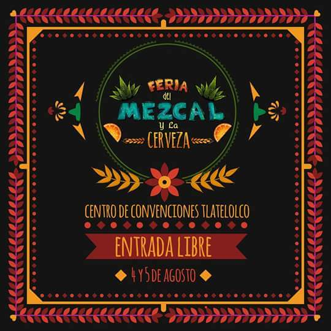
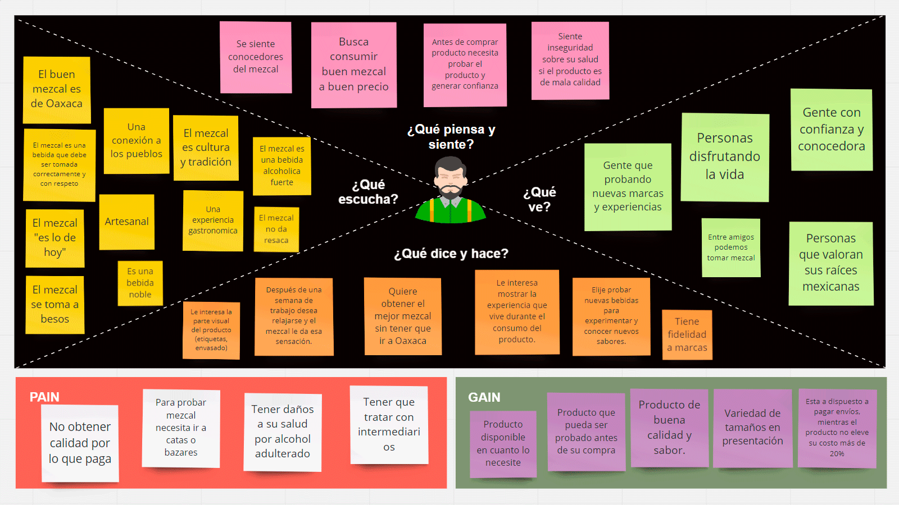

# E-commerce 
 
## Introduccion 

**El comercio electrónico (e-commerce) es el proceso mediante el cual dos o más partes realizan una transacción de negocios a través de una computadora o cualquier plataforma con acceso a internet.**

#### Las tiendas del futuro

A nivel mundial, las cifras ya reflejan el enorme potencial de hacer negocios através de internet. Según el sitio Internet Live Stats, en promedio 40 por ciento de la población mundial cuenta con una conexión a internet. De acuerdo con un reporte de la Asociación Mexicana de Internet (Amipci), en México, 51.2 millones de personas son usuarios frecuentes de internet, y el mercado de las ventas online de productos y servicios tiene un valor estimado de 121 mil millones de pesos.

#### Con el conocimiento de todo lo anterior se realizó una exhaustiva búsqueda de una empresa a la que le interesara implementar tecnología en su area de ventas,y después de una ardúa bsúqueda se eligio a Mi Mezcal,ya que pudo observarse mayor potencial en el mercado actual.

## Preambulo 

### Mi Mezcal 

> "Mi pasión es el mezcal ¿porque no vivir de ello?"

La marca **Mi Mezcal** fue fundada en  octubre del 2016 por un joven que, **crecio en una familia que ama el mezcal**,formando entonces parte de una tradicion familiar.

Mi Mezcal fue creado por la pasion al mezcal, la devoción hacia las raíces de México y los deseos de darlo a conocer en al mundo.

## Introduccion 

Mi mezcal fue fundadado en Octubre del 2016, durante estos dos años de operación ha logrado asistir a ferias de Mezcal y eventos importantes a nivel nacional como lo son :
 > La Feria del Mezcal y la Cerveza

 

 Además de prestar el servició de cata a empresas en eventos privados.

## Objetivo de la empresa
 
- El objetivo de **Mi Mezcal** es llegar a mas lugares de la república mexicana.
- En un futuro se planea llegar al extranjero dado de que existen puntos de contacto en Canada y Alemania.

## Insights de "Mi mezcal"

- El fundado realiza todos los procesos, a pesar de ser el único que participa en el negocio ha tenido un posicionamiento en el mercado y ganancias que han sido reinvertidas.
- Los canales de redes sociales están habilitados sin embargo no se actualizan constantemente debido a una falta de personal.
- El producto ha tenido aceptación en el mercado por lo cual cuenta con clientes regulares que sostienen el negocio.
- El principal canal de venta es vía telefónica y entregas en persona.
- Existe un esfuerzo por colocar el producto en mercados de servicios de catering
- El negocio no esta registrado en hacienda ni cuenta con permisos opera bajo el argumento “artesanal”
- El producto resulta ser una inversión que no caduca y puede tenerse en inventario sin problemas de tiempo.
- Posee una identidad y marca, esta registrado ante el IMPI.
- Existe un buen empaquetado, etiquetado, y embalaje
- El trato resulta ser informal al momento de realizar la transacción o entrega.
- Aun no esta registrado en hacienda.

## Investigacion 

Para lograr que Mi Mezcal se habra campo entre los mejores mezcales de México,se ha hecho una investigacion tomando en cuenta a los mezcales que ya se encuentran en el mercado.

Se realizo
- Mistery shopper
- Entrevista con el cliente
- Entrevista con usuario
- Entrevista con potenciales usuarios

Para poder asegurar una buena aceptacion del cliente en el ambito virtual se ha desarrolado lo siguiente:
## Empathy map

### La investigacion sigue en proceso 
